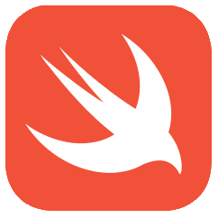

## Languages

 

&nbsp;

## Software

&nbsp;

---
Physics major with minors in Computer Science and French at Washington University in St. Louis. 2019 & 2020 Chassis System Lead for <a href="https://sae.wustl.edu/"> WashU Racing</a>. Undergraduate researcher within <a href="https://web.physics.wustl.edu/henriksen/">Henriksen Lab Group</a>.
